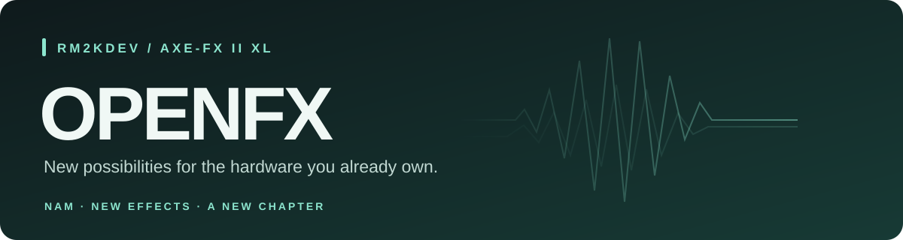

# OPENFX

**Giving the Axe-Fx II a new chapter. NAM captures. New effects. More possibilities.**

Created and led by **rm2kdev**, OPENFX is an independent project extending what the Axe-Fx II can do. This release brings Neural Amp Modeler support and additional effects to the **Axe-Fx II XL**, with matching controls in a modified Windows Axe-Edit.

**3.00 Preview R2** · **XL only** · **Windows Axe-Edit II 3.15.0** · **Highly experimental**

[Support rm2kdev on Ko-fi](https://ko-fi.com/rm2kdev) · [Features](#features) · [Installation](#getting-started) · [NAM captures](#3-convert-a-nam-file) · [Development and credits](#development-and-credits)

> [!WARNING]
> **This is highly experimental, unofficial firmware. Install and use it entirely at your own risk.**
>
> There may be bugs, crashes, failed boots, unexpected audio, compatibility problems, damaged hardware or lost/corrupted presets, captures and settings. Testing cannot guarantee that your device or data will be safe. Recovery is not guaranteed.
>
> **I, rm2kdev, am not responsible for damage, data loss or other issues resulting from installing or using OPENFX.** The project is supplied as-is, without warranty or any promise of reliability, fitness for purpose or ongoing support. This notice does not exclude rights or liabilities that cannot legally be excluded.
>
> **Back up everything you care about before flashing.** Keep your original firmware and a recovery plan. Start at low volume with a simple preset, and do not depend on this preview as your only rig for a performance.

## Why OPENFX?

The name **OPENFX** is about opening up the possibilities of this hardware. We have been able to liberate the Axe-Fx II from some of its original limitations and give it new capabilities, including NAM support, additional effects and a matching editor experience.

**“OPEN” does not mean that the complete firmware is open source.** Fractal Audio's original firmware and Axe-Edit remain proprietary. I do not have permission to redistribute their original work or release it as an open-source project, so OPENFX is not distributed as a complete firmware image, editor installation or reconstructed source project containing their code.

Instead, you obtain your own legitimate copies of the required Fractal Audio software and apply a **differential patch** locally. The patch describes the changes needed to add OPENFX's work on top of those originals. Your files supply the base; the patcher builds your modified copy on your own computer.

This distribution approach does not make the underlying software open source. Separately licensed upstream components retain their own licences, and a binary patch can include changed or relocated data; it should not be read as a guarantee that every byte in the difference is independently authored.

OPENFX is independent of Fractal Audio and is not affiliated with, endorsed by or supported by them.

## Features

| Addition | What it brings |
| --- | --- |
| **Neural Amp Modeler** | A separate NAM block supporting the verified A2 Lite capture layout. |
| **512 capture slots** | A named capture selector, with uploads through Fractal-Bot's user cab/IR workflow. |
| **Custom Axe-Edit support** | A NAM icon and parameter panel, plus the new effect types. |
| **DROP** | Downward semitone shifting in the existing Pitch block, using its polyphonic processing path. |
| **Cylon Peptour** | A new Drive type based on ChowCentaur. |
| **Ens Chorus** | A new Chorus type derived from ensemble-chorus. |
| **NAM metering** | Block input/output peak levels on the front-panel meters while editing NAM. |
| **OPENFX identity** | Custom splash screen and Open 3.00 firmware branding. |

These are adaptations for this hardware, not promises of exact equivalence to the upstream desktop plug-ins or any commercial pedal. **Not every `.nam` file is supported**; read the capture requirements before downloading models.

## Getting started

**Read the warning above and confirm your hardware before proceeding.** This package is for the **Axe-Fx II XL only**, not the XL+ or other Axe-Fx II variants.

**Start by extracting the entire ZIP, then double-click `START HERE.html`.** The patcher and NAM converter work offline in a current desktop Chrome, Edge or Firefox browser. Keep the folders together. No Python, Node.js, VisualDSP++ or developer licence is needed to use this release.

1. [Check the required originals and compatibility](#required-originals-and-compatibility).
2. [Patch and install your firmware](#1-patch-your-firmware).
3. [Patch your Windows Axe-Edit copy](#2-patch-your-windows-axe-edit-copy).
4. [Convert a supported NAM capture](#3-convert-a-nam-file).
5. [Upload it and select a model](#4-upload-a-capture-and-select-it).

Earlier NAM functionality has been used successfully on hardware, but the final R2 meter change and the complete combined release have not yet completed hardware acceptance testing. See [testing and rollback](#preview-testing-and-rollback) before installing. Packaged 24 September 2026.

## Required originals and compatibility

| Item | Required version |
| --- | --- |
| Hardware | **Axe-Fx II XL only** |
| Firmware file to patch | `AxeFx2_XL_Ares_2p00.syx`, extracted from the official XL Ares 2.00 ZIP |
| Editor file to patch | The installed Windows `Axe-Edit.exe` from **Axe-Edit II 3.15.0** |
| Transfer utility | Standalone Fractal-Bot; current release checked: 3.00.24 |
| NAM captures | Supported mono, 48 kHz A2 Lite topology; details below |

**Do not use the firmware patch with the original Axe-Fx II, Mark II, XL+, Axe-Fx III or another model.** There is no macOS Axe-Edit patch in this package. The browser tools themselves do not require Windows, but this preview's editor patch does.

Download your own originals directly from Fractal Audio:

- [Axe-Fx II downloads and USB drivers](https://www.fractalaudio.com/axe-fx-ii-downloads/) — choose the **XL** section.
- [Original XL Ares 2.00 firmware ZIP](https://www.fractalaudio.com/downloads/firmware-presets/axe-fx-2/Ares/2.0/AxeFx2_XL_Ares_2p00.zip).
- [Axe-Edit II downloads](https://www.fractalaudio.com/axe-edit-ii/) — Windows **3.15.0**, listed 15 July 2026, was the latest release checked on 24 September 2026. Future versions will need another patch.
- [Windows 3.15.0 installer](https://www.fractalaudio.com/downloads/axe-edit/Axe-Edit-Win-v3p15p0.exe).
- [Fractal-Bot download](https://www.fractalaudio.com/fractal-bot/) and [official transfer instructions](https://www.fractalaudio.com/downloads/fractal-bot/Fractal-Bot-Manual.pdf).

The release contains BPS differences, not complete vendor firmware, the editor executable, an installer or vendor DLLs. Recipients supply their own originals. A binary difference can contain changed data and is not a guarantee that every byte is newly authored. This project is independent of Fractal Audio; the included third-party notices do not grant rights to Fractal Audio's software or to third-party captures.

## 1. Patch your firmware

1. Download and extract your original XL Ares 2.00 firmware. Keep an unmodified copy.
2. Open `Tools/Patch files.html` in your browser.
3. Select **Axe-Fx II XL · Ares 2.00 firmware**.
4. For the original file, choose `AxeFx2_XL_Ares_2p00.syx`. Do not choose the ZIP or an already-modified firmware file.
5. For the patch, choose `Patches/OpenFX-3.00-XL-Preview-R2.bps` from this release.
6. Click **Verify, patch & save**. The tool checks the original, patch and result, then downloads:

`AxeFx2_XL_Open_3p00.NAM-DROP-CYLON-ENS-METERS-R2.syx`

If the original does not match, stop and obtain the specified original. Renaming another version will not make it compatible. The included tool rejects mismatches rather than attempting an unsafe patch.

Both patches were created using **ROM Patcher JS**, pinned to commit `3183884086825c3a57c72026234debcef1e2240c`. The offline tool includes its original BPS engine. Alternatively, use [ROM Patcher JS online](https://www.marcrobledo.com/RomPatcher.js/): set **ROM file** to your original and **Patch file** to the matching `.bps`, then apply. Keep checksum validation enabled. Its downloaded filename may differ; the result must match the output hash in `patch-manifest.json`. The included offline tool also verifies SHA-256 automatically.

### Send the patched firmware

1. Connect the XL by USB with its driver installed. Close Axe-Edit and other applications using its MIDI ports.
2. Open Fractal-Bot, select **SEND** and the connected Axe-Fx II XL.
3. Browse to the **newly generated firmware `.syx`** above, then begin the transfer and follow the on-screen prompts. Do not send the `.bps` patch to the hardware.
4. Leave power and USB connected throughout the update. When the device reports **UPDATE COMPLETE** and prompts for a restart, power it off and on.
5. Confirm that it boots, then try a simple preset before loading a large signal chain.

Firmware installation does not use a user cab destination. A request to choose a cab slot means you selected a capture or cab file instead of this firmware.

## 2. Patch your Windows Axe-Edit copy

1. Install the official **Windows Axe-Edit II 3.15.0**, then close it.
2. Find its installed folder. Copy the **whole folder** to a writable location, such as `Documents/OpenFX Axe-Edit`. Keep its support files and subfolders; a lone patched executable is not a complete installation.
3. Open `Tools/Patch files.html` and select **Axe-Edit II · Windows 3.15.0**.
4. Select the unmodified **`Axe-Edit.exe` inside your copied installation**. Do not select `Axe-Edit-Win-v3p15p0.exe`, which is the installer.
5. Select `Patches/Axe-Edit-3.15.0-Windows-OpenFX.bps` and click **Verify, patch & save**.
6. Move the downloaded `Axe-Edit-NAM-DROP-CYLON-ENS.exe` into that copied installation folder, alongside the original executable.
7. Close Fractal-Bot, launch the new executable and connect it to the XL running this firmware. Allow effect definitions to finish loading. Use this executable for OpenFX; your old shortcut still opens the original editor unless you change it.

NAM should have its own icon and controls, including Capture, Drive, Input Select, mix/level and bypass controls. The Pitch, Drive and Chorus type lists should include the new types. If the panel is missing, first check that you launched the **patched executable**, connected to the XL running the **matching firmware**, and allowed definitions to refresh. Do not manually delete settings or caches as a first troubleshooting step.

## 3. Convert a NAM file

1. Open `Tools/Convert NAM.html` in your browser.
2. Drag in one `.nam` file, or browse to it.
3. Click **Convert & save SysEx**. A compatible capture becomes `YourCapture.NAM.syx` in your browser's download location.

The converter does not ask for a slot. It validates the model and converts locally; it does not upload your capture to a website or communicate with the XL. The output is capture data, **not a firmware update**.

### Supported captures

The firmware runs the verified **A2 Lite** architecture: mono, 48 kHz, NAM schema 0.7.0, one layer array with 3 channels, the supported 23-layer convolution/LeakyReLU layout, and 1,871 weights. The complete layout is checked, not just the filename. If an A2 container includes exactly one compatible Lite profile, that profile is selected automatically.

A2 Full, other channel counts, LSTM and other WaveNet layouts are not supported. An unsupported file cannot be made compatible just by renaming it; this converter does not retrain models. An error leaves the device untouched and produces no SysEx. Capture names are limited to 31 printable ASCII characters on the device; other characters become underscores.

No additional `.nam` capture files are bundled. The patched firmware retains its built-in default capture. Only share third-party captures when you have permission.

## 4. Upload a capture and select it

1. Close Axe-Edit. In Fractal-Bot **SEND**, choose your XL and the converted `YourCapture.NAM.syx`.
2. Fractal-Bot uses its **user cab/IR** upload workflow for this file. Choose the destination there, using the table below. Start the transfer and wait for completion.
3. On the XL, add/select **NAM** in the grid, press **EDIT**, and use the **MODEL** selector to choose the corresponding NAM slot. In the patched Axe-Edit, use NAM's **Capture** selector.
4. Store your preset if you want to retain the selection. To add another capture, convert it and send it to a different destination.

| Fractal-Bot user cab destination (1-based) | NAM selector |
| --- | --- |
| 513 | 001 |
| 514 | 002 |
| 515 | 003 |
| … | … |
| 1024 | 512 |

**Fractal-Bot destination = NAM slot + 512.** The order is ascending. Destination 1024 is NAM 512, not NAM 001.

The 512 NAM locations share the upper half of the XL's user cab storage. Ordinary cabinet IRs use destinations **1–512**; NAM captures use **513–1024**. Uploading to a location overwrites its existing contents, including an old cabinet IR in the upper half. Keep a backup and do not select NAM storage as a cabinet IR.

The SysEx file carries a default destination of **513 / NAM 001** because the transfer format requires one. Fractal-Bot's selected destination overrides it, so the same converted file can be placed in any NAM slot. A generic SysEx sender that sends bytes unchanged will use destination 513; use Fractal-Bot when you want to choose another location. Do not put the device into firmware update mode for capture uploads.

## Trying the effects and meters

- **DROP:** select the new type in Pitch and lower the semitone setting (0 to −12). Start with a fully wet signal for a transposed output. Chords, tracking, latency and CPU use should be evaluated on your own presets.
- **Cylon Peptour:** select the new type in Drive; start with modest drive and output levels.
- **Ens Chorus:** select the new type in Chorus and adjust its available controls. This is a hardware adaptation, with fewer options than the original desktop effect.
- **NAM meters:** while the front panel is on NAM's EDIT screen, INPUT 1 shows the stereo signal entering the block and INPUT 2 shows its output. The footer reads `VU1:NAM IN VU2:NAM OUT`. These are peak meters using the existing LED scale, not calibrated RMS VU meters. Leaving the screen restores the normal physical input meters. Physical clip indicators retain their normal purpose.

The input meter tap is before NAM input selection/gain; the output tap is after mix, pan, level and bypass. An empty input meter can therefore mean there is no signal routed into the block. The footer alone does not prove that the meter switching works on hardware; that is one of the R2 checks still awaiting confirmation.

## Preview testing and rollback

Both BPS patches have been applied to the required originals and compared **byte for byte** with the intended modified files. Incorrect originals were rejected. Converter output is compared against the existing Python converter; see `verification.json` for release checks and limitations.

The meter revision passed isolated simulator checks including all 48 grid positions, audio preservation, display preservation and exiting back to normal metering. This was not a complete simulated boot with real peripherals. Editor checks verified resource mappings and preserved stock layouts, but do not replace a live GUI/MIDI test of this exact combined build. Heavy presets may exceed available CPU or memory. Do not rely on a preview as your only rig for a performance.

To revert, send your own untouched **XL Ares 2.00** firmware with Fractal-Bot and return to the original Axe-Edit executable. Restore your original preset/system/cab backups as needed; stock firmware does not understand the new block and type definitions. Reinstalling firmware alone does not restore user cab slots overwritten by captures.

If the XL cannot boot normally after an update, the emergency recovery entry used on the development XL is: power off, hold **both PAGE buttons**, then power on. Use the recovery update workflow to restore your original XL firmware. Keep the [official downloads and manuals](https://www.fractalaudio.com/axe-fx-ii-downloads/) available. If recovery cannot be reached or the transfer cannot complete, stop repeated flashing attempts and seek device-specific support.

When reporting a problem, include the release name, hardware model, selected block/type, whether it happens from the front panel or editor, and whether the problem reproduces with a simple preset. Do not include vendor firmware or a paid capture in a public report.

## Files and verification

- `Patches/`: the two BPS differences.
- `Tools/`: offline browser patcher and NAM converter, with readable JavaScript source.
- `patch-manifest.json`: exact source, patch and output sizes and SHA-256/CRC32 values.
- `verification.json`: packaging checks and existing firmware/editor verification scope.
- `CHECKSUMS.sha256`: SHA-256 of release contents, excluding itself.
- `LICENSES/`: upstream notices for the code used by the patches and tools.

Required original SHA-256 values:

| Original | SHA-256 |
| --- | --- |
| XL Ares 2.00 `.syx` | `24daabbadbf804b4a089cdd29f822bdb651f2011a96990bf7a068277436c8243` |
| Windows Axe-Edit II 3.15.0 `Axe-Edit.exe` | `c37d3cc5e46f86d6cf8f75c1712bc30321b6a01c174c3761549000312a646652` |

Share the extracted release folder or its ZIP. Do not add your reconstructed firmware, patched editor installation, vendor installers or private capture collection to it.

## Development and credits

Development has received **heavy assistance from ChatGPT Codex Astra**, used as a tool and technical collaborator for implementation, tooling, debugging and verification.

OPENFX also builds on the work of these projects and their contributors:

| Project | Contribution | Licence notices |
| --- | --- | --- |
| [Neural Amp Modeler](https://github.com/sdatkinson/NeuralAmpModelerCore) | Neural amp modelling foundations | [MIT](LICENSES/Neural-Amp-Modeler.txt) |
| [ChowCentaur](https://github.com/AviateAudio/ChowDSP_ChowCentaur) | Basis for Cylon Peptour | [BSD 3-Clause and additional notices](LICENSES/ChowCentaur.txt) |
| [ensemble-chorus](https://github.com/jpcima/ensemble-chorus) | Basis for Ens Chorus | [Boost 1.0 and BBD model notices](LICENSES/Ensemble-Chorus.txt) |
| [ROM Patcher JS](https://github.com/marcrobledo/RomPatcher.js) | Creating and applying the BPS patches | [MIT](LICENSES/ROM-Patcher-JS.txt) |

Preserve the included notices when sharing the package. These licences cover their respective components, not Fractal Audio's proprietary software or third-party captures.

## Support OPENFX

If you enjoy giving this hardware new possibilities and would like to support the time spent experimenting, testing and developing OPENFX, you can support **rm2kdev** on Ko-fi.

**[☕ Support OPENFX on Ko-fi →](https://ko-fi.com/rm2kdev)**

Support is optional and appreciated. It does not purchase a warranty, guaranteed compatibility, priority support or a promise of future features.
